# Bitespeed-Backend

## Code Flow
# Backend
Index.ts(server file) -> Router -> Controller -> Service

Service -> Database(Postgressql)

# Endpoints

 api/v1/identity

    Method : POST
    Body : JSON body
    Body Content : 
    {
        email : "....",
        phoneNumber : "....",
    }

    hit the  api using postman or from Frontend

## Approach Flow
1. find contacts where email OR phone matches
2. get all linkedIds
3. fetch entire contact group
4. find oldest primary
5. decide:
   - create secondary
   - merge primaries
6. return aggregated data

## What to do ? 
=> Create new contact -> when no entry in db is present
=> Create new secondary contact -> when one primary contact is present
=> Update the second primary contact -> When multiple primary contacts can be linked with given request

## In example we have two primaries and merged the contacts in this case, What if there are more than 2 primaries ?

=> Oldest contact is primary, rest of them should be secondary

## What if the request exactly matches in case of one primary contact ?

=> we dont have to create new contact 

#### Outcomes

### Case (new primary contact) :
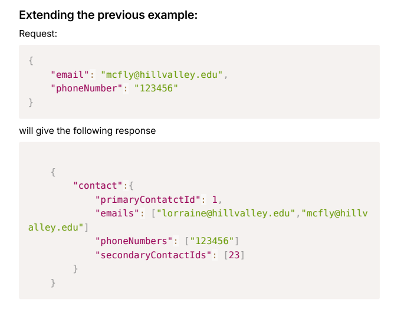

  ## API Response
  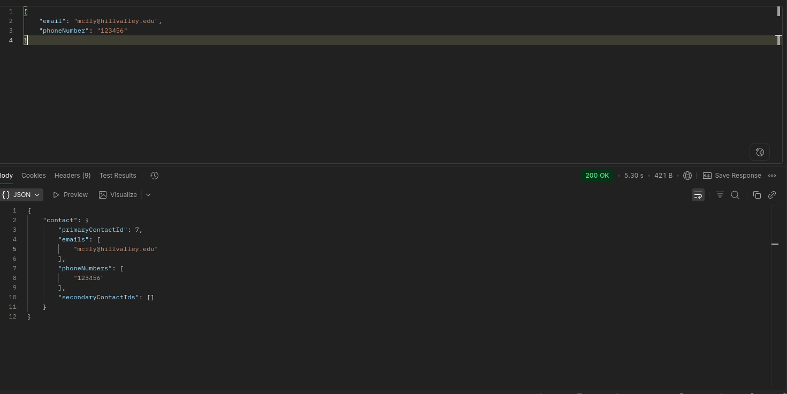

### Case (new secondary created): 
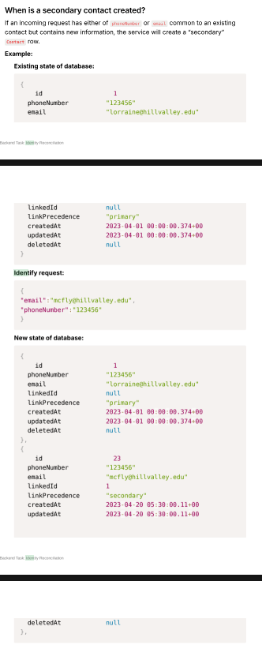

  ## API Response
  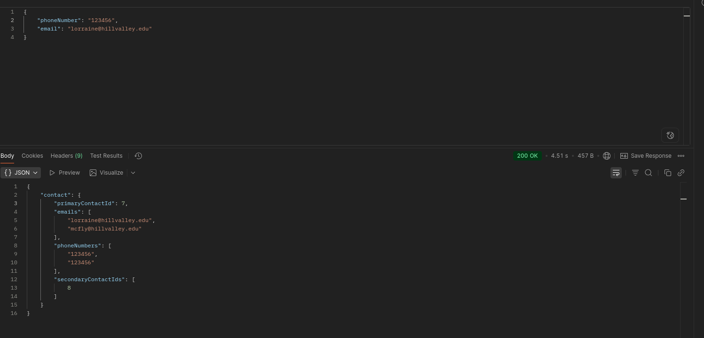

### Case (can primaries change to secondary) : 
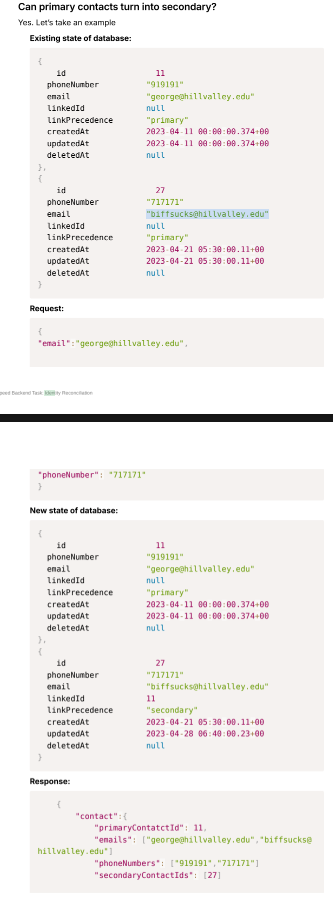

Initial DB state :
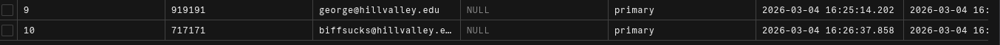

  ## API Response
  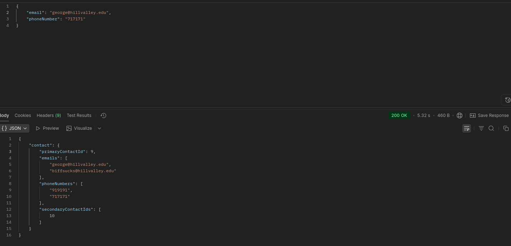

Final DB state :
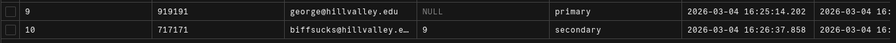

### Case (multiple matching case) (custom - edge case not in the assignment) :

Initial DB state :
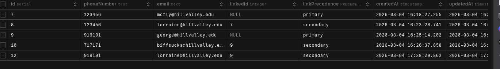

Scenario :
    Refer to the db state you obtain for this refer above
    links to : ->
    12 -> 9 (secondary)
    10 -> 9 (secondary)
    9 -> null (primary)
    8 -> 7 (secondary)
    7 -> null (primary)

    if I try to merge 8 and 9 then all should link to oldest primary ie 7 in this case

  ## API Response  
  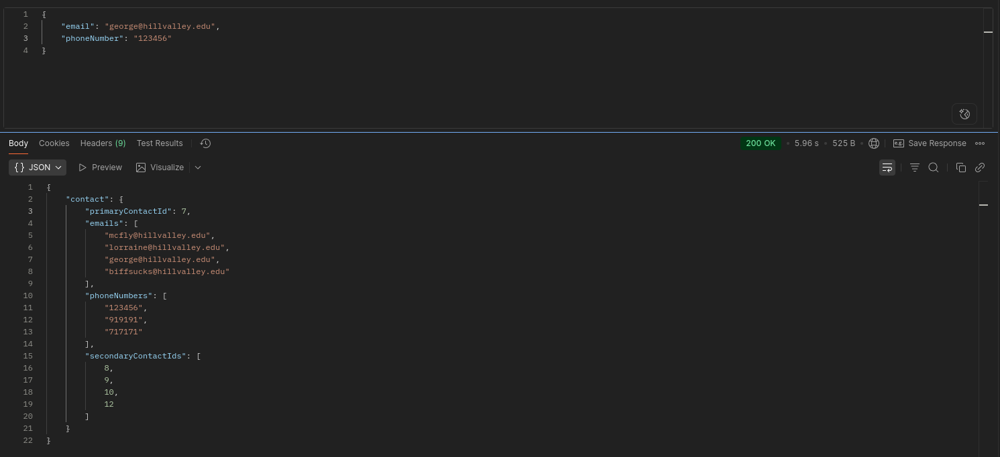

  Final DB state :
  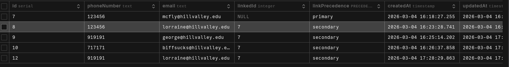

### Frontend UI 
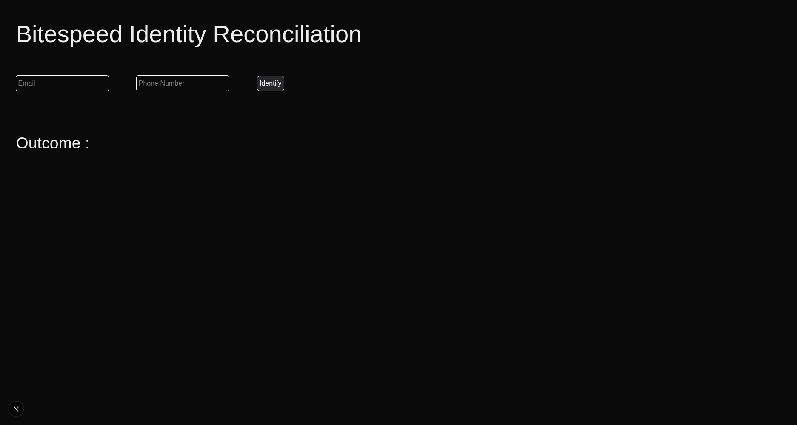

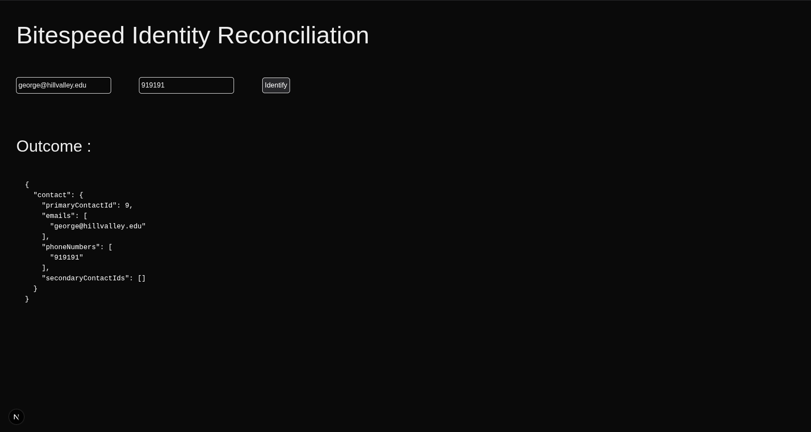
